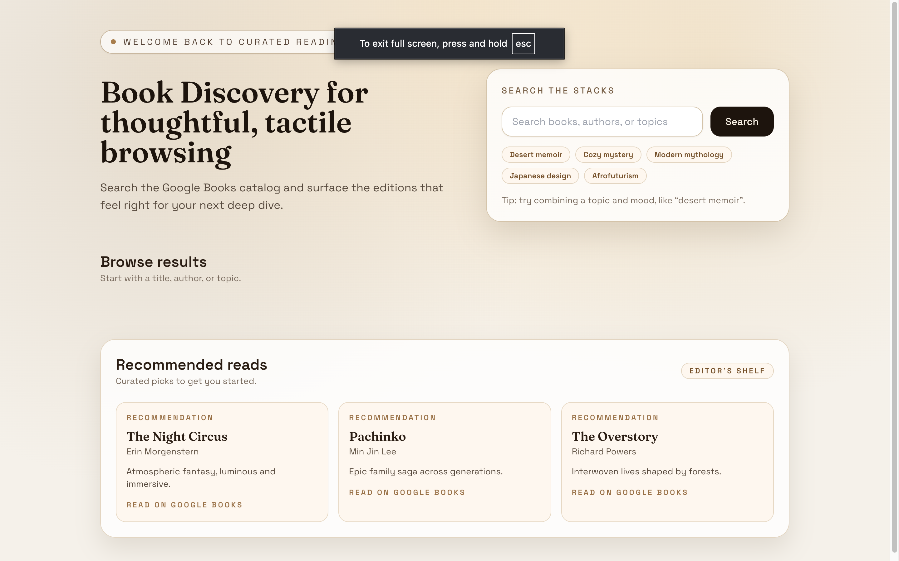
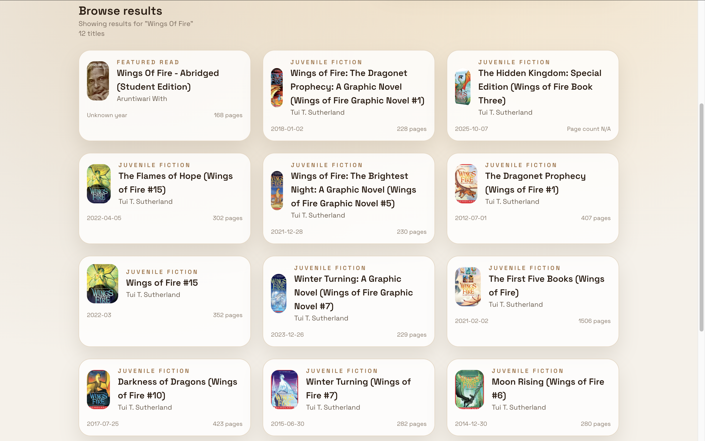

# Book Discovery

Book Discovery is a polished React + Tailwind UI that helps readers explore the Google Books catalog. It combines a refined editorial layout with fast search, quick-pick chips, and a detail modal for each title.

## Features

- Search the Google Books API with instant feedback
- Curated quick-pick chips for discovery
- Responsive, editorial-inspired layout with custom typography
- Accessible modal with keyboard escape and click-to-dismiss
- Recommended reads section with external links

## Screenshots




## Tech Stack

- React 19
- Vite (rolldown-vite)
- Tailwind CSS 3

## Getting Started

### 1) Install dependencies

```
npm install
```

### 2) Configure environment variables

Create a `.env` file in the project root:

```
VITE_API_KEY=your_google_books_api_key
```

### 3) Run the app

```
npm run dev
```

The app runs on http://localhost:5174 by default.

## Scripts

- `npm run dev` - start the dev server
- `npm run build` - build for production
- `npm run preview` - preview the production build
- `npm run lint` - run ESLint

## Project Structure

```
book-discovery/
	components/      # screenshot assets for GitHub
	public/
	src/
```

## Deployment

Build the project and deploy the `dist/` folder using your preferred hosting provider.

```
npm run build
```

## License

MIT

## Acknowledgements

Data is sourced from the Google Books API.
